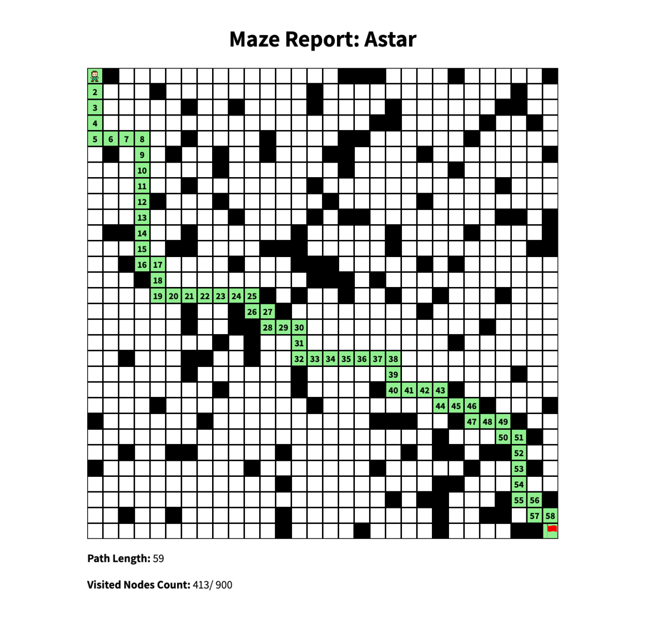
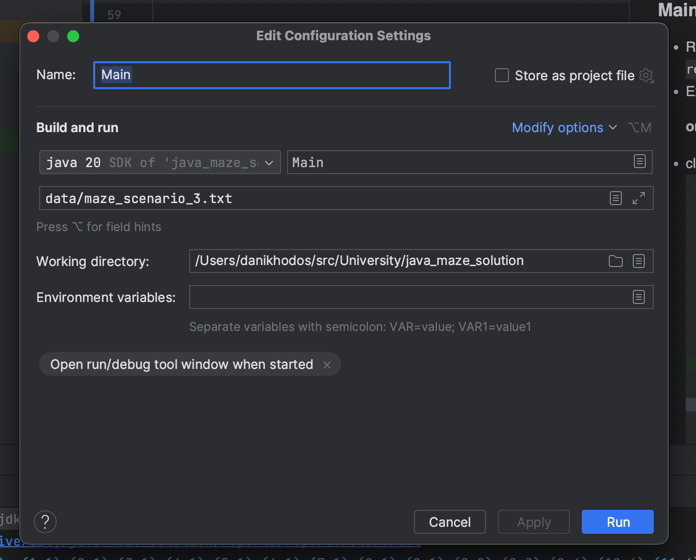

# Maze Solver

This project provides a set of search algorithms to solve a maze. The maze is represented as a grid, where each cell can either be a walkable path or an obstacle. The goal is to find a path from a starting point to an end point.


## Rules
- Rules and instructions are specified in this [assignment](static/maze_assigment.pdf).

## Scenarios:
- for input: `data/maze_scenario_1.txt` output: `outputs/maze_scenario_1.txt` (5X5)
- for input: `data/maze_scenario_2.txt` output: `outputs/maze_scenario_2.txt` (10X10)
- for input: `data/maze_scenario_3.txt` output: `outputs/maze_scenario_3.txt` (30X30)

## Project Structure:
- 📁 **.github** - GitHub actions for automatic test (CI).
- 📁 **.idea** - IntelliJ project files
- 📁 **data** - possible inputs for the Main program.
- 📁 **outputs** - outputs for the possible inputs for the Main program.
- 📁 **reports** - HTML report template, and the folder that the temp reports are generated for.
- 📁 **src** - the actual Java code.
- 📁 **static** - a resource folder, mostly for the readme and the reports.
- 📁 **tests** - tests folder, with its own test data.
- 📄 **java_maze_solution.iml** - class path dependencies (for IntelliJ projects).

## Features

- **Search Algorithms**: The project includes multiple search algorithms:
  - A* Search: Uses a combination of the cost to reach a node and a heuristic to estimate the cost from that node to the goal.
  - Greedy Search: Expands the node that is estimated to be closest to the goal using a heuristic.
  - Uniform Cost Search: Expands the node with the lowest path cost.
- **Maze Parser**: Parses a maze from a file.
- **Report Generation**: Generates an HTML report based on a given solution path through the maze.
- **Search Executor**: Executes a list of search algorithms on a given maze, logs the execution time, displays the results, and generates a report for each algorithm.
- **Maze Generator**: Generates random mazes based on a given difficulty level.
- **Testing**: Comprehensive unit tests for the search algorithms, maze parser, maze functionalities, and maze path reconstruction.

## Classes

- **Maze**: Represents a grid-based maze with nodes.
- **Node**: Represents a point in the maze.
- **MazePath**: Represents a path through a maze using a map to store the relationship between a node and its predecessor in the path.
- **SearchAlgorithm**: An abstract class that provides the base for search algorithms.
- **Logger**: Provides color-coded console logging.
- **MazeParser**: Parses a maze from a file.
- **ReportMaker**: Generates an HTML report.
- **SearchExecutor**: Executes search algorithms and generates reports.
- **SearchResult**: Holds the result of a search algorithm.
- **MazeGenerator**: Generates random mazes.
- **Main**: The actual extraction class, to run the program.

## Usage

### Main Program
- program expects a path (relative ot absolute) to a NxN maze file as in the assign task.

  #### In Intelij IDE
- click the green run arrow in `Main.java` with this config:
  

  #### In shell (mac/ linux)
  - Run: 
  ```shell
    chmod +x compile_and_run.sh
  ```
  - Run:
  ```shell
    ./compile_and_run.sh <path-to-maze-file>
  ```
  - Example with `data/maze_scenario_3.txt`:
  ```shell
    ./compile_and_run.sh data/maze_scenario_3.txt
  ```
  #### In powershell (windows)
  - Run:
  ```shell
    .\compile_and_run.ps1 <path-to-maze-file>
  ```
  - Example with `data/maze_scenario_3.txt`:
  ```shell
    .\compile_and_run.ps1 data/maze_scenario_3.txt
  ```
  #### Main Program Flow:
  - program excepts a single path to a file
    - if nothing is provided, you will get a usage print.
  - program will open the provided file.
    - if file doesn't exist you will get and error.
    - if file is invalid you will get and error.
  - program will run all 3 algorithms.
  - program will print to standard input the logs and results.
  - program will create normalized `<filename>.txt` output file in `outputs` with results only.
  - program will generate an HTML report file for each algorithm:
    - `reports/report.Astar.html`
    - `reports/report.Greedy.html`
    - `reports/report.UCS.html`

### Maze Generator (tests/MazeGenerator.java)
- Run main in `java MazeGenerator.java`, you may adjust the size and difficulty in the main method.

## Tests
### Install Dependencies (IntelliJ)
- Dependencies are located in `java_maze_solution.iml`.
- Install using your local IDE package manager.

### **AStarTest**:
  - `testSolve`: Checks if the A* algorithm can solve a basic maze.
  - `testSolveUnsolvableMaze`: Validates that the A* algorithm correctly identifies an unsolvable maze.
  - `testSolveBigMaze`: Tests the A* algorithm's performance and correctness on a larger maze.

### **GreedySearchTest**:
- `testSolve`: Checks if the Greedy algorithm can solve a basic maze.
- `testSolveUnsolvableMaze`: Validates that the Greedy algorithm correctly identifies an unsolvable maze.
- `testSolveBigMaze`: Tests the Greedy algorithm's performance and correctness on a larger maze.

### **UniformCostSearchTest**:
- `testSolve`: Checks if the Uniform Cost Search algorithm can solve a basic maze.
- `testSolveUnsolvableMaze`: Validates that the Uniform Cost Search algorithm correctly identifies an unsolvable maze.
- `testSolveBigMaze`: Tests the Uniform Cost Search algorithm's performance and correctness on a larger maze.

### **MazeParserTest**:
- `testParseMaze`: Validates that the maze parser correctly reads and interprets a maze file.
- `testEmptyFile`: Checks the parser's behavior when provided with an empty file.
- `testSizeMissingFile`: Validates the parser's behavior when the maze size is missing from the file.

### **MazeTest**:
- `testGetNeighbors`: Checks if the maze correctly identifies the neighbors of a given node, considering obstacles.

### **MazePathTest**:
- `testAdd`: Validates the addition of nodes and their predecessors to the path.
- `testGetReconstructPathDataExists`: Checks the correct reconstruction of the path when data exists.
- `testGetReconstructPathEmpty`: Validates the behavior when trying to reconstruct a path with no data.
- `testGetReconstructPathSorted`: Ensures the reconstructed path is correctly sorted.


### To run the tests:

- Use stock IntelliJ / Eclipse test runner.

## Github CI
- Check `.github/workflows/tests.yaml`.

## Notes
- This project is using the **Record** keyword which were introduced in `Java 14`: https://www.baeldung.com/java-record-keyword
